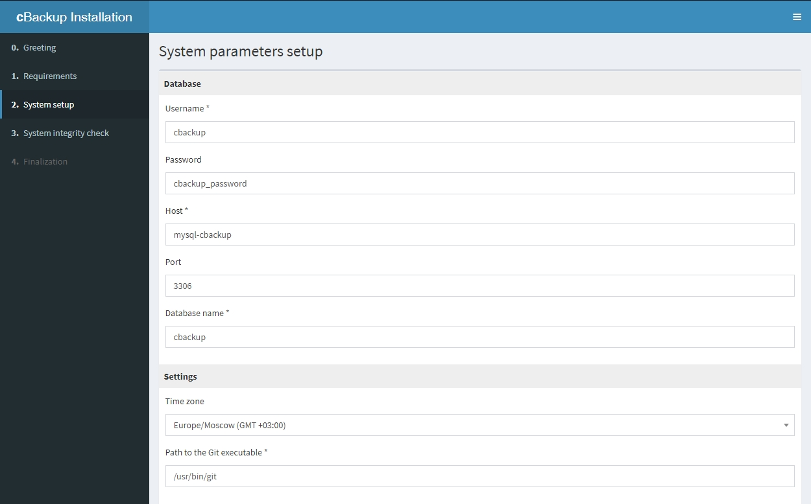
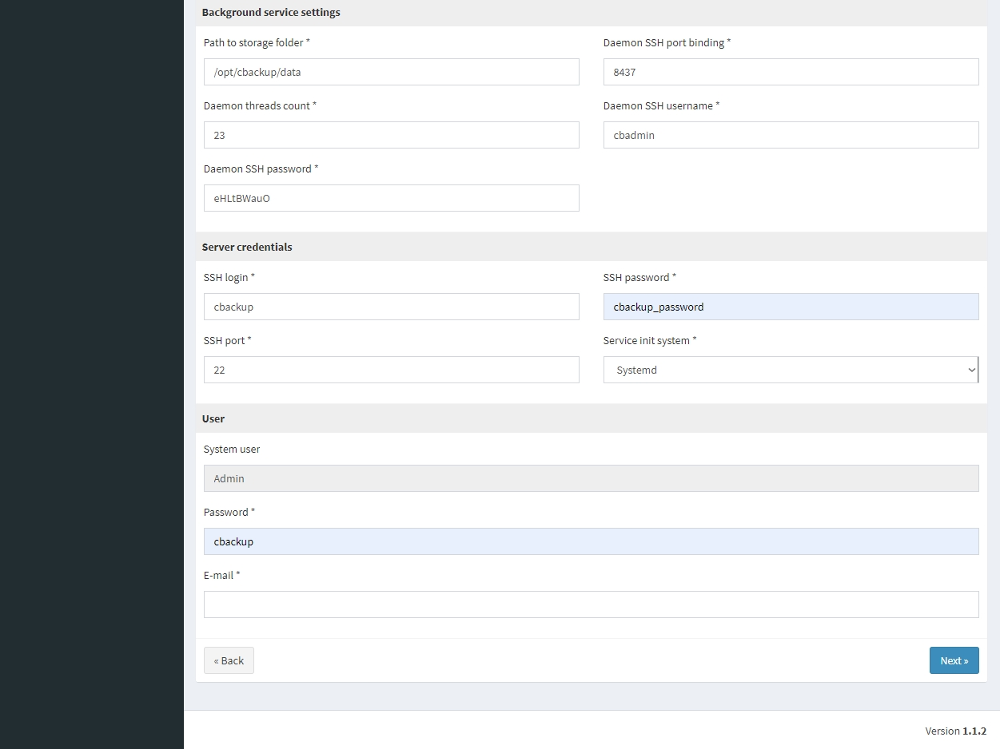

# Docker-контейнеры для системы резервного копирования сетевого оборудования [cBackup](https://cbackup.me/ru/)

## Делаем исполняемыми файлы

    cd ./cbackup-docker
    chmod +x *.sh
    cd ./step-by-step/
    chmod +x *.sh

## Создаем образы

    ./00-build-images.sh

## Создаем Docker-сеть для контейнеров

    ./05-create-docker-network.sh

## Запуск контейнеров

    ./10-run-mysql-cbackup.sh
    ./15-run-cbackup.sh

## Логины/пароли

### Контейнер mysql-cbackup

| Описание                  | Login   |         Password |
|:------------------------- |:-------:| ----------------:|
| root пользователь mysql   | root    |  root_password   |
| база данных: cbackup      | cbackup | cbackup_password |

### Контейнер cbackup

| Описание               | Login      | Password           |
|:---------------------- |:----------:| ------------------:|
| системный пользователь | cbackup    |  cbackup_password  |

http://ip-address/cbackup/index.php

Для дальнейшей настройки cBackup, воспользуйтесь [официальной инструкцией](https://cbackup.readthedocs.io/en/latest/getting-started/initial-setup/)

Скрипт первоначальной настройки cbackup для резервного копирования сетевого оборудования вендоров d-link (моделей DGS-1210-ME) и Mikrotik (любые модели)

    ./update-db.sh
